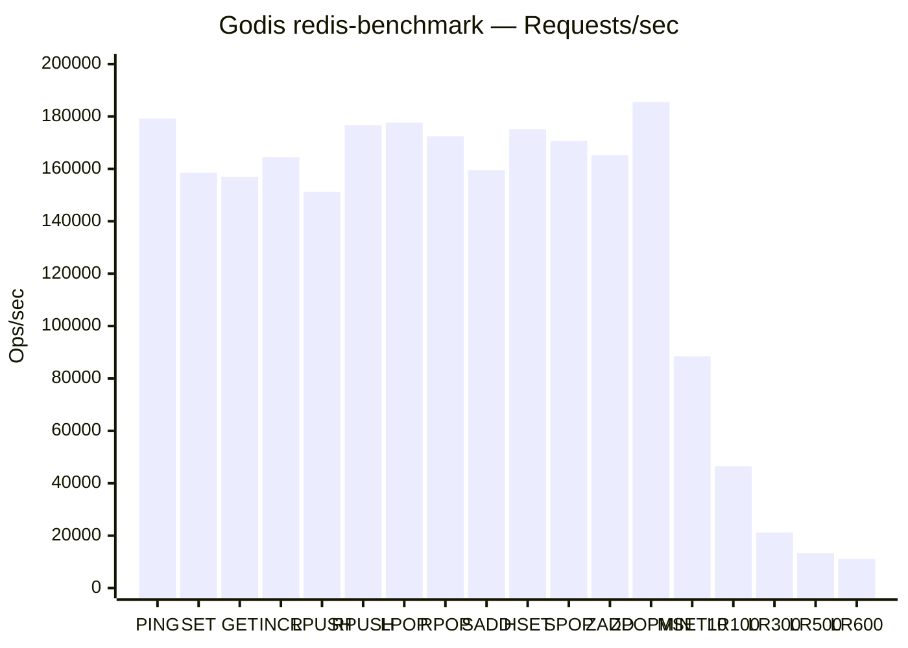

# Godis v1.3.1


[](https://github.com/Hoverhuang-er/godis/actions?query=branch%3Amaster)
[](https://coveralls.io/github/Hoverhuang-er/godis?branch=master)
[](https://goreportcard.com/report/github.com/Hoverhuang-er/godis)
[](https://pkg.go.dev/github.com/Hoverhuang-er/godis)
<br>
[](https://github.com/avelino/awesome-go)

[中文版](https://github.com/Hoverhuang-er/godis/blob/master/docs/README_CN.md) | [日本語](https://github.com/Hoverhuang-er/godis/blob/master/docs/README_JA.md) | [Suomi](https://github.com/Hoverhuang-er/godis/blob/master/docs/README_FI.md)

`Godis` is a golang implementation of Redis Server, which intents to provide an example of writing a high concurrent
middleware using golang.

Key Features:

- Redis 8.8.0 command compatibility
- Support string, list, hash, set, sorted set, bitmap
- HyperLogLog (PFADD, PFCOUNT, PFMERGE)
- Bloom filter (BF.ADD, BF.EXISTS, BF.RESERVE)
- T-Digest (TDIGEST.ADD, TDIGEST.QUANTILE)
- Top-K (TOPK.ADD, TOPK.QUERY, TOPK.LIST)
- Count-min sketch (CMS.INCRBY, CMS.QUERY)
- Geospatial indexes (GEOADD, GEOSEARCH, etc.)
- Bitfield (BITFIELD, BITFIELD_RO)
- RediSearch (FT.CREATE, FT.SEARCH, FT.DROPINDEX, etc.)
- Time Series (TS.CREATE, TS.ADD, TS.GET, TS.RANGE, etc.)
- Redis-Vector (VECTOR field type, KNN search)
- RedisJSON (JSON.SET, JSON.GET, JSON.DEL, JSON.ARRAPPEND, JSON.OBJKEYS, etc.)
- Concurrent Core for better performance
- TTL
- Publish/Subscribe
- Streams (XADD, XREAD, XGROUP, etc.)
- GEO
- AOF and AOF Rewrite
- RDB read and write
- Multi Database and `SELECT` command
- Transaction is **Atomic** and Isolated. If any errors are encountered during execution, godis will rollback the executed commands
- Replication
- Server-side Cluster which is transparent to client. You can connect to any node in the cluster to access all data in the cluster.
- Cluster metadata management based on Raft. Support dynamic expansion, rebalancing and failover.
- `MSET`, `MSETNX`, `DEL`, `Rename`, `RenameNX` command is supported and atomically executed in cluster mode, allow over multi node.
- `MULTI` Commands Transaction is supported within slot in cluster mode

If you could read Chinese, you can find more details in [My Blog](https://www.cnblogs.com/Finley/category/1598973.html).

## Quick Start

### Standalone (Linux / macOS)

```bash
# Download the binary from GitHub Releases
curl -LO https://github.com/Hoverhuang-er/godis/releases/download/v1.3.1/godis_linux_amd64.zip
unzip godis_linux_amd64.zip

# Run with minimal config
CONFIG=config/standalone.toml ./godis

# Or use the default auto-detection (looks for standalone.toml in cwd)
./godis
```

### Standalone (Windows)

```powershell
# Download godis_windows_amd64.zip from Releases, extract
# Run in PowerShell:
$env:CONFIG="config\standalone.toml"
.\godis.exe
```

### Docker Compose (Minimal)

```bash
git clone https://github.com/Hoverhuang-er/godis.git
cd godis
docker compose up -d
redis-cli -p 6399 PING
```

Minimal `docker-compose.yml`:

```yaml
services:
  godis:
    image: ghcr.io/Hoverhuang-er/godis:latest
    ports:
      - "6399:6399"
    volumes:
      - godis-data:/data
      - ./config/standalone.toml:/etc/godis/standalone.toml:ro
    environment:
      - CONFIG=/etc/godis/standalone.toml
    restart: unless-stopped

volumes:
  godis-data:
```

### Docker (Single Container)

```bash
docker run -d --name godis \
  -p 6399:6399 \
  -v godis-data:/data \
  ghcr.io/Hoverhuang-er/godis:latest
```

### Cluster Mode (Multi-Node)

```bash
# Start a 3-node cluster
CONFIG=config/cluster.toml ./godis &
```

Connect to any node to access the full dataset:

```bash
redis-cli -p 6399
```

### Prometheus Monitoring

Godis exposes Prometheus-compatible metrics at `/metrics` on port `9121` (configurable via `monitoring.prometheus_port` in `standalone.toml`). Metrics are **enabled by default** and follow `redis_exporter` naming conventions for compatibility with existing Redis dashboards.

```bash
# Scrape endpoint (default)
curl http://localhost:9121/metrics
```

**Key metrics exposed:**
- `godis_connected_clients` — current active connections
- `godis_commands_total` — total commands processed
- `godis_keyspace_hits_total` / `godis_keyspace_misses_total` — cache hit/miss counters
- `godis_db_keys` — per-database key counts
- `godis_db_avg_ttl_seconds` — average TTL per database
- `godis_slowlog_length` — slow log queue length
- Hot key and big key detection (periodically sampled)

To disable metrics, set `prometheus_enabled = false` in the `[monitoring]` section of your config. All monitoring config changes are hot-reloaded at runtime.

```toml
[monitoring]
prometheus_enabled = true
prometheus_port = 9121
```

## Kubernetes Deployment

### Helm Chart (Recommended)

For production deployments, use the Helm chart:

```bash
# Add repository and install
helm pull oci://ghcr.io/Hoverhuang-er/godis/charts/godis --version 1.3.1
helm install godis ./godis-1.3.1.tgz

# Or install directly
helm install godis oci://ghcr.io/Hoverhuang-er/godis/charts/godis --version 1.3.1

# Cluster mode (3 nodes)
helm install godis-cluster oci://ghcr.io/Hoverhuang-er/godis/charts/godis --version 1.3.1 \
  --set mode=cluster --set replicaCount=3
```

See [charts/godis/values.yaml](https://github.com/Hoverhuang-er/godis/blob/main/charts/godis/values.yaml) for all configuration options.

### Kubernetes Operator

The Godis Operator manages GodisCluster custom resources. Deploy with:

```bash
# Install CRD
kubectl apply -f https://raw.githubusercontent.com/Hoverhuang-er/godis/main/config/crd/godisclusters.yaml

# Deploy operator (default: 3 nodes, 0.5 CPU / 1Gi memory per node)
kubectl create deployment godis-operator --image=ghcr.io/Hoverhuang-er/godis/operator:1.3.1

# Create a Godis cluster (standalone)
kubectl apply -f - <<EOF
apiVersion: godis.Hoverhuang-er.io/v1
kind: GodisCluster
metadata:
  name: my-godis
spec:
  mode: standalone
  port: 6399
  resources:
    requests:
      cpu: 500m
      memory: 1Gi
EOF
```

#### Autoscaling

The operator supports HPA, VPA, and KEDA:

```yaml
apiVersion: godis.Hoverhuang-er.io/v1
kind: GodisCluster
metadata:
  name: my-godis-cluster
spec:
  mode: cluster
  replicas: 3
  resources:
    requests:
      cpu: 500m
      memory: 1Gi
  autoscaling:
    enabled: true
    minReplicas: 3
    maxReplicas: 10
    targetCPUUtilizationPercentage: 70
    targetMemoryUtilizationPercentage: 80
    enableVPA: true
    enableKEDA: true
```

Supported Kubernetes versions: **1.34–1.36** and **k3s** (any supported version).

## Rueidis Client Example

[Rueidis](https://github.com/redis/rueidis) is a high-performance Redis client for Go. Here's how to use it with Godis:

```go
package main

import (
	"context"
	"fmt"
	"log"

	"github.com/redis/rueidis"
)

func main() {
	client, err := rueidis.NewClient(rueidis.ClientOption{
		InitAddress: []string{"localhost:6399"},
	})
	if err != nil {
		log.Fatal(err)
	}
	defer client.Close()

	ctx := context.Background()

	// SET/GET example
	err = client.Do(ctx, client.B().Set().Key("foo").Value("bar").Build()).Error()
	if err != nil {
		log.Fatal(err)
	}

	val, err := client.Do(ctx, client.B().Get().Key("foo").Build()).ToString()
	if err != nil {
		log.Fatal(err)
	}
	fmt.Printf("GET foo = %s\n", val)

	// RediSearch example
	// Requires FT.CREATE index first
	result, err := client.Do(ctx, client.B().FtSearch().Index("idx").Query("@field:val").Build()).ToArray()
	if err != nil {
		log.Printf("Search note: %v (create index with FT.CREATE first)", err)
	}
	_ = result

	// Time Series example
	err = client.Do(ctx, client.B().TsAdd().Key("ts:temp").Timestamp(1).Value(25.5).Build()).Error()
	if err != nil {
		log.Printf("Time series note: %v", err)
	}
}
```

## Supported Commands

See: [commands.md](https://github.com/Hoverhuang-er/godis/blob/master/commands.md)

## Benchmark

Environment: **Go 1.23**, MacOS Monterey 12.5, Apple M2 Air



| Command | Ops/sec | p50 |
|---|---|---|
| PING_INLINE | 179,211 | 1.03 ms |
| PING_MBULK | 173,611 | 1.07 ms |
| SET | 158,479 | 1.54 ms |
| GET | 156,986 | 1.13 ms |
| INCR | 164,474 | 1.06 ms |
| LPUSH | 151,286 | 1.08 ms |
| RPUSH | 176,678 | 1.02 ms |
| LPOP | 177,620 | 1.04 ms |
| RPOP | 172,414 | 1.04 ms |
| SADD | 159,490 | 1.05 ms |
| HSET | 175,131 | 1.03 ms |
| SPOP | 170,648 | 1.03 ms |
| ZADD | 165,289 | 1.04 ms |
| ZPOPMIN | 185,529 | 1.00 ms |
| MSET (10 keys) | 88,417 | 3.69 ms |
| LRANGE_100 | 46,512 | 4.06 ms |
| LRANGE_300 | 21,218 | 9.31 ms |
| LRANGE_500 | 13,332 | 14.41 ms |
| LRANGE_600 | 11,153 | 17.01 ms |

## Read My Code

The project follows the [Go Project Layout](https://github.com/golang-standards/project-layout) standard:

```
godis/
├── cmd/                          # Entry points
│   ├── godis/main.go             # Godis server — standalone or cluster
│   ├── godis/cli.go              # Built-in redis-cli (--cli flag)
│   └── operator/main.go          # Kubernetes operator controller
├── internal/                     # Private application code
│   ├── config/                   # TOML config (viper, hot-reload, embedded default)
│   ├── tcp/                      # TCP server — connection accept, goroutine-per-conn
│   ├── redis/                    # Redis wire protocol
│   │   ├── parser/               # RESP2/RESP3 parser (streaming, zero-copy)
│   │   ├── protocol/             # Reply types (Bulk, MultiBulk, Error, Integer, etc.)
│   │   ├── server/               # Server adapters
│   │   │   ├── std/              #   Standard net.TCP listener
│   │   │   └── gnet/             #   gnet event-loop (higher throughput)
│   │   ├── client/               # Client for inter-node relay in cluster mode
│   │   └── connection/           # Per-connection state (DB index, auth, multi)
│   ├── interface/                # Core interfaces (DB engine, connection, reply)
│   ├── database/                 # Storage engine & command handlers
│   │   ├── server.go             # Multi-database server (AOF, replication, slowlog)
│   │   ├── database.go           # Single database core (data access, TTL, locks)
│   │   ├── router.go             # Command table — register + route
│   │   ├── string.go             # GET, SET, INCR, APPEND, GETBIT, etc.
│   │   ├── hash.go               # HSET, HGET, HDEL, HGETALL, etc.
│   │   ├── list.go               # LPUSH, LRANGE, LINDEX, LTRIM, etc.
│   │   ├── set.go                # SADD, SMEMBERS, SINTER, SUNION, etc.
│   │   ├── sortedset.go          # ZADD, ZRANGE, ZRANK, ZSCORE, etc.
│   │   ├── stream.go             # XADD, XREAD, XGROUP, XACK, etc.
│   │   ├── geo.go                # GEOADD, GEOSEARCH, GEODIST, etc.
│   │   ├── keys.go               # DEL, EXISTS, EXPIRE, TTL, TYPE, etc.
│   │   ├── transaction.go        # MULTI, EXEC, WATCH — atomic & isolated
│   │   ├── persistence.go        # RDB loading from disk
│   │   ├── timeseries.go         # TS.CREATE, TS.ADD, TS.GET, TS.RANGE
│   │   ├── search.go             # FT.CREATE, FT.SEARCH, FT.DROPINDEX, FT.INFO
│   │   ├── json.go               # JSON.SET, JSON.GET, JSON.DEL, JSON.ARRAPPEND, etc.
│   │   ├── bloom.go              # BF.ADD, BF.EXISTS, BF.RESERVE, BF.MADD
│   │   ├── hyperloglog.go        # PFADD, PFCOUNT, PFMERGE
│   │   ├── topk.go               # TOPK.ADD, TOPK.QUERY, TOPK.LIST
│   │   ├── cms.go                # CMS.INCRBY, CMS.QUERY, CMS.MERGE
│   │   ├── tdigest.go            # TDIGEST.ADD, TDIGEST.QUANTILE
│   │   ├── bitfield.go           # BITFIELD, BITFIELD_RO
│   │   └── array.go              # AR.SET, AR.GET, AR.APPEND, AR.POP
│   ├── aof/                      # Append-Only File persistence & rewrite
│   ├── pubsub/                   # Publish/Subscribe channel hub
│   ├── cluster/                  # Cluster mode
│   │   ├── core/                 # Slot routing, TCC transactions, migration
│   │   ├── commands/             # Cluster-aware DEL, MSET, RENAME via TCC
│   │   └── raft/                 # Raft consensus — metadata, failover
│   ├── monitoring/               # Prometheus /metrics endpoint (redis_exporter compatible)
│   ├── auth/entraid/             # Entra ID JWT token validation (Azure AD)
│   ├── datastruct/               # Low-level data structure implementations
│   │   ├── dict/                 # Concurrent hash map (lock-striped)
│   │   ├── list/                 # Quicklist (linked list segments)
│   │   ├── set/                  # Hash set
│   │   ├── sortedset/            # Skip list
│   │   ├── bitmap/               # Bit array
│   │   ├── stream/               # Radix-tree-based stream
│   │   ├── search/               # Inverted index (terms → docs, scoring)
│   │   ├── hyperloglog/          # Probabilistic cardinality (2^14 registers)
│   │   ├── bloom/                # Bloom filter (k-hash, optimal m)
│   │   ├── cms/                  # Count-min sketch (frequency estimation)
│   │   ├── topk/                 # Top-K frequent items
│   │   ├── tdigest/              # T-Digest (quantile estimation)
│   │   ├── timeseries/           # Time series samples
│   │   ├── array/                # Sparse index-addressable array
│   │   └── lock/                 # Key-level read/write lock manager
│   └── lib/                      # Utility libraries
│       ├── logger/               # Structured file logger
│       ├── pool/                 # Generic object pool
│       ├── timewheel/            # Time wheel — expiration & cron
│       ├── wildcard/             # Glob pattern matching
│       ├── consistenthash/       # Consistent hashing ring
│       ├── idgenerator/          # Snowflake ID generator
│       ├── arena/                # Memory arena allocator
│       └── greenteagc/           # GC tuning (GCPercent=40, thread pinning)
├── config/                       # Configuration files
│   ├── standalone.toml           # Standalone server config
│   ├── cluster.toml              # Cluster mode config
│   └── crd/                      # Kubernetes CRD definitions
├── charts/                       # Helm chart for Kubernetes deployment
└── patches/                      # Patched dependencies (boltdb riscv64 support)
```

### Suggested reading order

Start with the **entry point** (`cmd/godis/main.go`) and follow the flow:

1. **`internal/config/`** — how godis loads and hot-reloads its configuration
2. **`internal/tcp/`** + **`internal/redis/parser/`** — how connections are accepted and RESP requests are parsed
3. **`internal/database/`** — the core: `router.go` (dispatch) → `server.go` (multi-db orchestration) → individual command files
4. **`internal/datastruct/`** — the data structures that power each command (dict, skiplist, quicklist, etc.)
5. **`internal/aof/`** + **`internal/database/persistence.go`** — durability: AOF rewrite and RDB loading
6. **`internal/cluster/`** — distributed mode: Raft consensus, slot routing, TCC transactions
7. **`internal/monitoring/`** — observability: Prometheus metrics

# License

This project is licensed under the [GPL license](https://github.com/Hoverhuang-er/godis/blob/master/LICENSE).